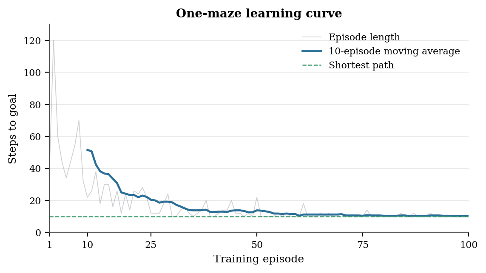
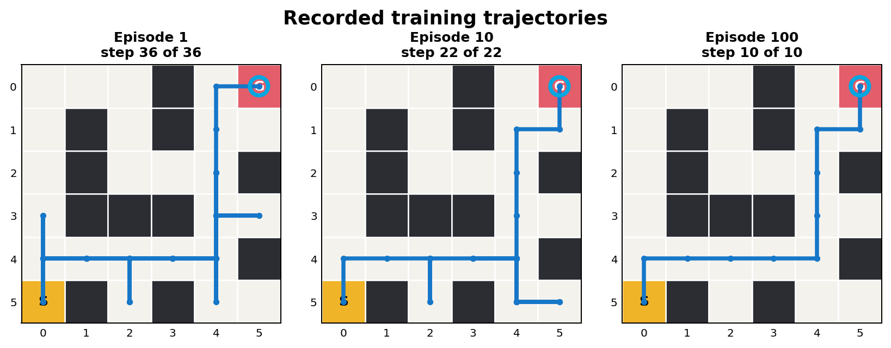
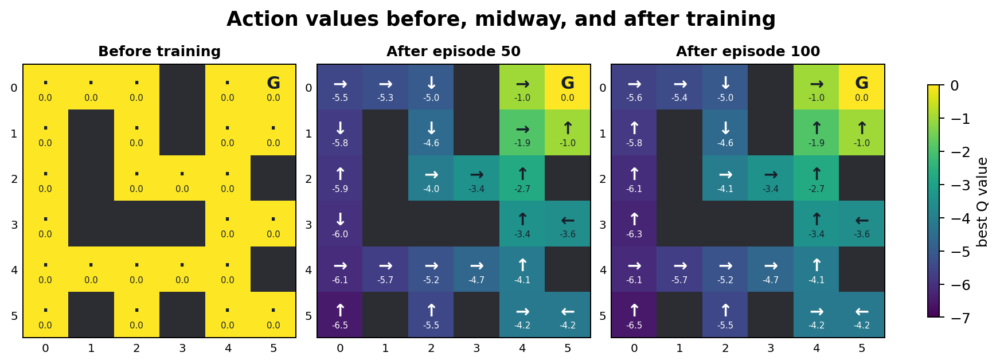
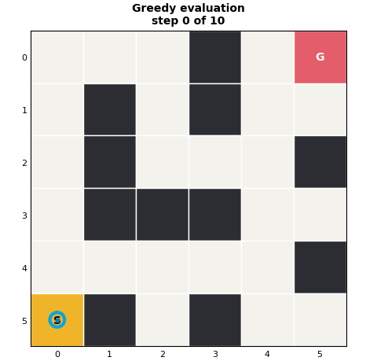

# Q-learning maze in Rust

This is the implementation of the Q-Learning in Rust with following parameters.
### Parameters
- Episodes: 100
- `alpha`: 0.5 - Learning rate
- `gamma`: 0.9
- `epsilon`: 0.4 -> 0.02 decaying
- Reward: -1 per step.

It uses one 6 x 6 maze and saves the items requested on slide 40:
Q-values before, midway through, and after training, plus the paths from episodes 1, 10, and 100.

[Read the report](report.pdf)

The Rust program writes CSV data under `output/data/`. The Python script reads those files and creates the figures and GIFs.



The light line shows every episode. The darker line is a moving average: at episode 10 it averages episodes 1 to 10, at episode 11 it averages episodes 2 to 11, and so on.

## Update rule

```text
Q(s, a) <- Q(s, a) + alpha [r + gamma max Q(s', a') - Q(s, a)]
```

Training uses epsilon-greedy action selection and only legal maze moves. When several legal actions have the same best value, the program chooses between them randomly.





After training, the program runs a separate greedy check with `epsilon = 0`. This check does not change the Q-table. With seed 7, it reaches the goal in 10 steps.


